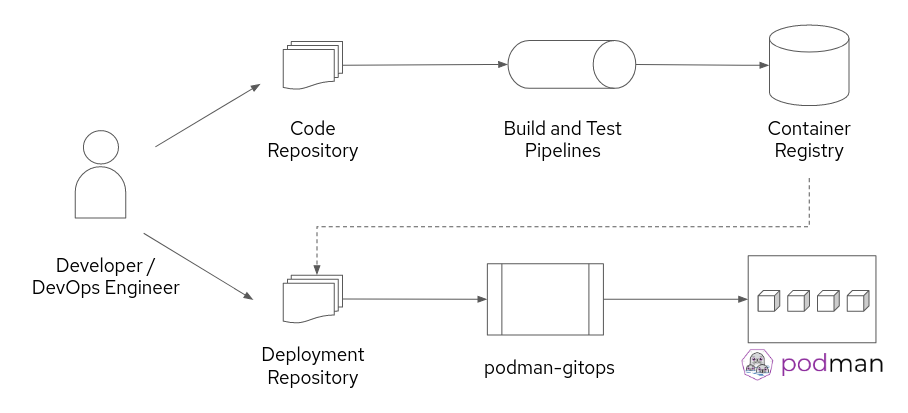

# podman-gitops

Apply GitOps concepts to Podman based container deployment use cases

## Goal
GitOps is well-defined for OpenShift and other K8S platforms. An introduction to GitOps with OpenShift can be found here: https://blog.openshift.com/introduction-to-gitops-with-openshift/

However, there are use cases where container based workloads should run on bare Linux systems without Kubernetes. GitOps workflows should be applicable for Podman based systems as well.

The goal of podman-gitops is to provide an example implementation for applying GitOps to Podman based solutions.

## Key concepts
- Leverage Podman's pod functionality so that pods can be used for OpenShift and Podman deployments.
- All configurations are stored and managed in Git. Key manifests for this use case are the K8S pod yamls.
- Users define pods in K8S-like manifests, which are automatically deployed to Podman.
- A configuration file per podman systems defines the Git repository, which contain pod yaml manifests that are deployed on the podman systems. This configuration file is managed in git as well.
- The Podman Linux system run autonomously and pulls changes from Git.

## High level flow

- Developer develops and tests code for a Pod and builds container images which is published in a registry. These Pods could be built with the OpenShift Source-to-Image (S2I) functionality and tested within OpenShift build pipelines.
- Tested containers are published into a registry. This could be the registry in OpenShift.
- A DevOps engineer (or the developer) creates environment specific pod yaml files to specify container image versions, ENVs, etc. as well as a system specific configuration file that defines a list of Git repositories which will be inspected for Pod yaml files.
- All changes to the environment specific pod yaml files or ystem specific configuration file follows the well-known GitOps workflow including pull requests etc so that only reviewed changes are deployed into staging and production eviroments.
- podman-gitops runs on a regular schedule (corntab) in the podman system, looks for changes in git and automatically deploys the pods that are placed in the defined repos.



## Usage
```
usage: python3 update-podman.py [-h] [-v] [-f CONFIG_FILE] [-c] [-u] [-s] [-d] [-a]

optional arguments:
  -h, --help            show this help message and exit
  -v, --verbose         Verbose output
  -f CONFIG_FILE, --config_file CONFIG_FILE
                        Configuration yaml file
  -c, --check           Run various checks
  -u, --update          Update local repos
  -s, --setup           Create local repos
  -d, --destroy         Destroy local repos
  -a, --apply           Apply configuration to local podman. Play or delete
                        pods
```

## Warning
- The content in this repo is experimental. 
- update-podman pulls and starts container images. Never use it with untrusted code repositories or untrusted container registries.

